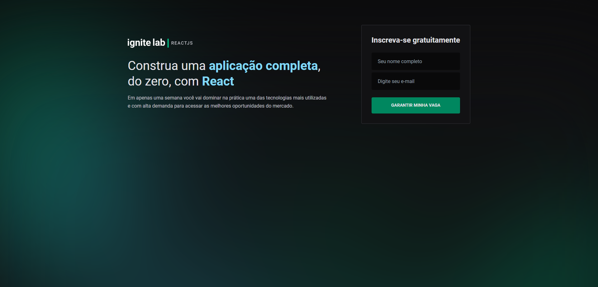
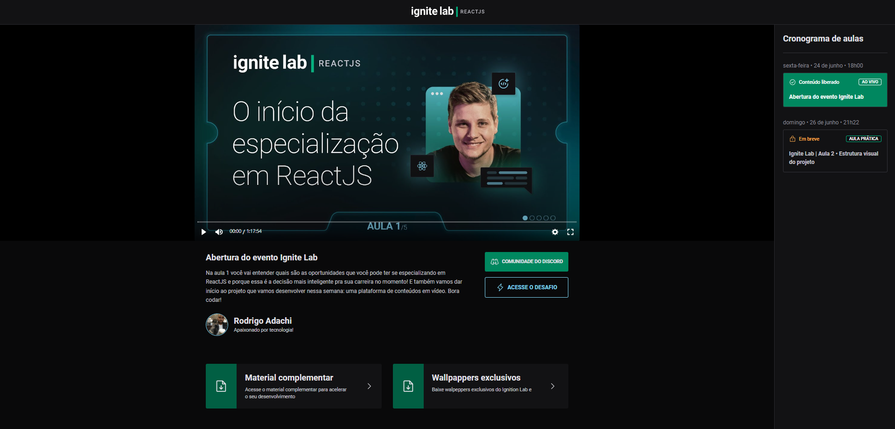

# ignite-lab React|JS
## _Online Events Platform application developed with React, GraphQL, Apollo, QRaphQL Codegen, GraphCMS and Vercel_

## Features

- Lesson 1 • The beginning of the ReactJS specialization
- Lesson 2 • Visual structure of the project
- Lesson 3 • Class routing and player
- Lesson 4 • Enrollment via GraphQL
- Lesson 5 • Deployment, CodeGen and next steps

## Tech

Stack of technologies used in the project:

- [Vite] - Next Generation Frontend Tooling
- [ReactJS] - A JavaScript library for building user interfaces
- [React Router Dom] - React Router is a collection of navigational components
- [GraphQL] - A query language for your API
- [Apollo GraphQL] - The best way to manage|GraphQL
- [GraphQL Code Generator] - Generate code from your GraphQL schema
- [GraphCMS] - Build Your GraphQL Content API. Instantly.
- [Tailwind CSS] - Rapidly build modern websites without ever leaving your HTML.
- [Vercel] - Vercel: Develop. Preview. Ship. For the best frontend teams


## Installation

```sh
git clone https://github.com/adelino-masioli/ignite-lab-react
cd ignite-lab-react
npm i
node run dev
```

For local environment

```sh
touch .env.local
VITE_API_URL="https://api-eu-west-2.graphcms.com/v2/your-tocken/master"
VITE_API_ACCESS_TOKEN="your-tocken"
```

### Screenshot




## License
MIT
